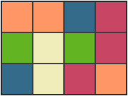

The Game of Match
=================

This is basic implementation of little matching game in Chinese term as
( **连连看** ), however this project particular focus on the way of
developments rather than game play mainly, and more importantly its algorithm
behinds.

Spotlight
---------

- algorithm of core logic
- CoffeeScript and *Literate* CoffeeScript
- AngularJS
- LESS CSS
- jQuery free
- compile free, runs on-the-fly in browser
- git-flow
- unit test (Jasmine)
- mobile friendly
- IE8+

License
-------
MIT
